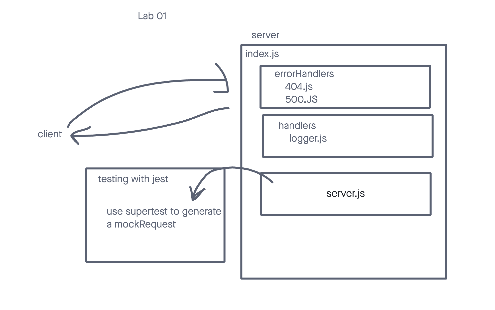

# LAB - Class 04

## Project: Server Practice

### Author: Ty Aponte

### Problem Domain

To practice server deployment

### Links and Resources

- [GitHub Actions ci/cd](https://github.com/Ty-Ap/api-server/actions)
- [back-end server url](not done yet)

### Setup

#### `.env` requirements (where applicable)

DATABASE_URL=postgres://localhost:5432/api-server

#### How to initialize/run your application (where applicable)

- e.g. `npm start`

#### How to use your library (where applicable)

#### Features / Routes

- Feature One: full CRUD for database of heroes and villains
- ROUTES:
- `/person` - specific route to hit
- `/hero`
- `/customer`- this paths villains right now, too tired to change now, willdo later.

#### Tests

- How do you run tests? `npm test`
- Any tests of note? `one of them turns lex luthor into elon musk, so that was hilarious of me`
- Describe any tests that you did not complete, skipped, etc

#### UML

